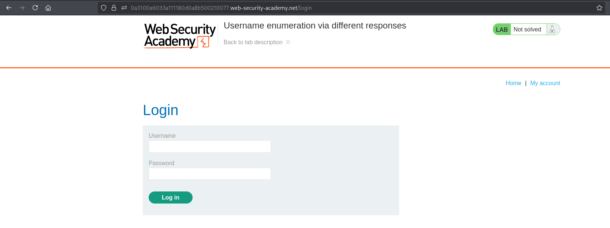
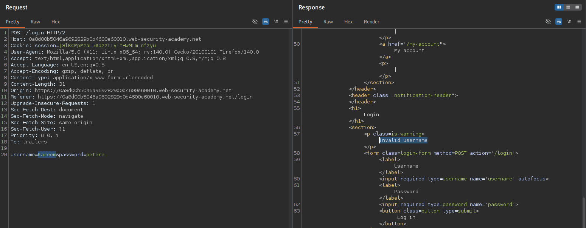
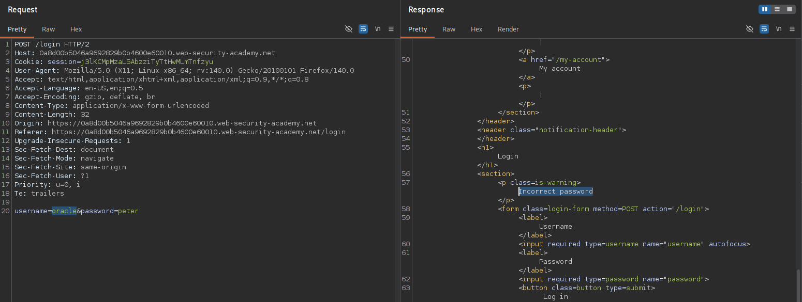
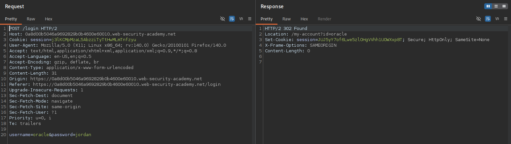
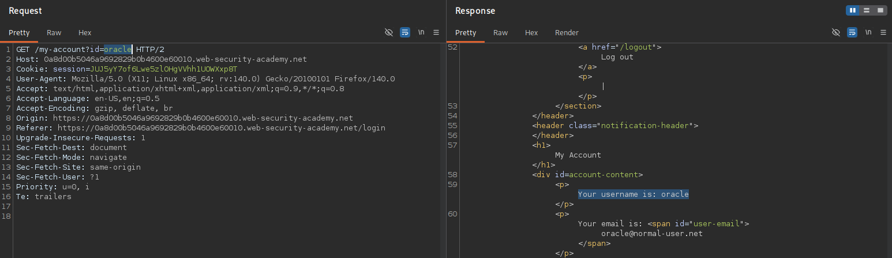
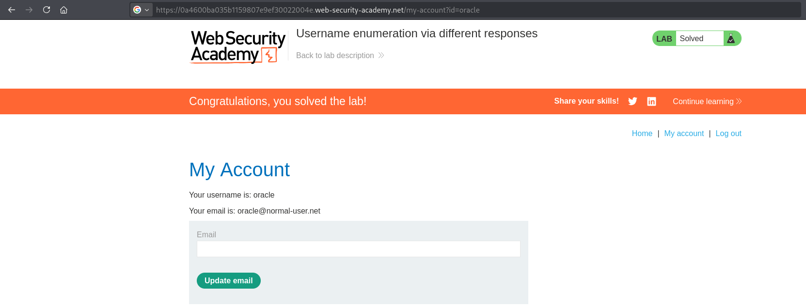

# AUTH-001 - Username Enumeration via Different Responses

## Report Information

- **Category:** Authentication
- **Subcategory:** Username Enumeration
- **Severity:** Medium

---

## Executive Summary

The application exposes different authentication responses depending on whether the supplied username exists.

By comparing authentication responses during login attempts, an attacker can enumerate valid usernames before launching password attacks.

After identifying a valid username, a password brute-force attack was performed against that account, resulting in successful authentication and access to the victim's account.

This issue significantly increases the effectiveness of credential-based attacks such as password brute-force, password spraying, and credential stuffing.

---

## Affected Components

- Login functionality
- Authentication mechanism
- User authentication workflow

---

## Vulnerability Description

The application returns different authentication responses depending on whether the supplied username exists.

When an invalid username is submitted, the application responds with:

```
Invalid username
```

However, when a valid username is supplied with an incorrect password, the response changes to:

```
Incorrect password
```

This behavioral difference allows attackers to distinguish valid usernames from invalid ones without possessing valid credentials.

Once a valid username is identified, password attacks can focus solely on existing accounts, significantly increasing the efficiency of credential-based attacks.

---

## Proof of Concept (PoC)

### Step 1 – Open the Login Page

Navigate to the application's login page.

**Screenshot 1:** Login Page.



---

### Step 2 – Observe the Default Authentication Response

Submit a login request using an invalid username.

The application responds with:

```
Invalid username
```

**Screenshot 2:** Invalid Username Response.



---

### Step 3 – Enumerate Valid Usernames

Use Burp Intruder with the provided username wordlist while keeping the password constant.

While reviewing the Intruder results, most responses returned:

- HTTP Status: **200**
- Response Length: **3352**

One response returned:

- HTTP Status: **200**
- Response Length: **3354**

This difference indicated that the supplied username was valid.

**Screenshot 3:** Username Enumeration.


---

### Step 4 – Verify the Valid Username

Replay the identified request in Burp Repeater.

Instead of returning:

```
Invalid username
```

the application responds with:

```
Incorrect password
```

confirming that the username exists.

**Screenshot 4:** Invalid Password Response.



---

### Step 5 – Perform Password Brute Force

Fix the discovered username and use Burp Intruder with the provided password list.

During the attack, one request returned:

- HTTP Status: **302**
- Response Length: **188**

Unlike previous responses, this request also returned a new authenticated session cookie and a redirect.

**Screenshot 5:** Password Brute Force.


---

### Step 6 – Inspect the Successful Authentication Response

Replay the successful request in Burp Repeater.

The response returns:

- HTTP **302 Found**
- `Set-Cookie`
- `Location: /my-account?id=oracle`

confirming successful authentication.

**Screenshot 6:** Login Success Request & Response.



---

### Step 7 – Verify Authenticated Access

Follow the redirect while preserving the issued session cookie.

The application grants access to the authenticated user's account.

**Screenshot 7:** Authenticated Account.



---

### Step 8 – Verify Lab Completion

After successfully authenticating as the victim user, the lab is marked as solved.

**Screenshot 8:** Lab Completed.



---

## Impact

Successful exploitation could allow an attacker to:

- Enumerate valid usernames.
- Identify valid accounts for targeted attacks.
- Reduce the complexity of password brute-force attacks.
- Increase the effectiveness of password spraying attacks.
- Improve the success rate of credential stuffing attacks.
- Gain unauthorized access to user accounts if valid credentials are discovered.

---

## Root Cause

The application exposes account existence information by returning different authentication responses for invalid usernames and valid usernames with incorrect passwords.

Instead of returning a generic authentication failure message for every unsuccessful login attempt, the application reveals whether the supplied username exists before validating the password.

This information disclosure enables attackers to enumerate valid usernames and significantly improves the effectiveness of subsequent password attacks.

---

## Remediation

To prevent this issue:

- Return a generic authentication error such as:

```
Invalid username or password.
```

for every failed login attempt.

Additionally:

- Normalize HTTP status codes.
- Normalize response bodies.
- Normalize response lengths.
- Normalize response times.
- Implement rate limiting.
- Apply account lockout or progressive delays.
- Deploy Multi-Factor Authentication (MFA) where appropriate.
- Monitor authentication logs for username enumeration and brute-force attacks.