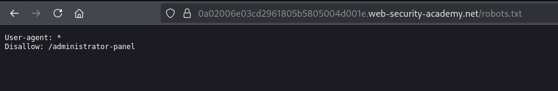
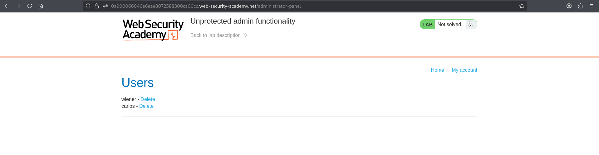
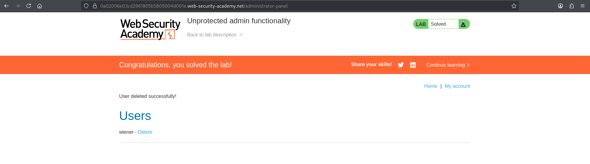

# Lab 01 - Unprotected Admin Functionality

## Lab Information

- **Category:** Broken Access Control
- **Difficulty:** Apprentice
- **Vulnerability:** Unprotected Admin Functionality

---

## Objective

Gain unauthorized access to the administrator panel and delete the user **Carlos**.

---

## Tools Used

- Web Browser
- Burp Suite
- FFUF *(Alternative discovery method)*

---

## Methodology

Before attempting to solve the lab, I followed my standard web application assessment methodology:

1. Browse the application manually.
2. Understand the application's functionality and business logic.
3. Intercept traffic using Burp Suite.
4. Review HTTP requests and responses.
5. Inspect the Burp Suite sitemap.
6. Check common discovery files.
7. If nothing is found, perform content discovery using FFUF.

---

## Reconnaissance

After exploring the application manually, I identified the available pages and analyzed the HTTP traffic using Burp Suite.

No administrative functionality was exposed through the application's user interface.

---

## Discovery and Verification

### Step 1 – Discover the Administrator Endpoint

Navigate to:

```text
/robots.txt
```

The `robots.txt` file reveals the following administrative endpoint:

```text
/administrator-panel
```

**Screenshot 1:** Administrator endpoint disclosed in `robots.txt`.



---

If the endpoint had not been disclosed through `robots.txt`, it could also have been discovered using directory enumeration with FFUF.

Example:

```bash
ffuf -u https://LAB-ID.web-security-academy.net/FUZZ \
-w wordlists/mini_dr_wordlist \
-fc 404
```

The scan successfully identified:

```text
/administrator-panel
```

---

### Step 2 – Access the Administrator Panel

Navigate directly to:

```text
/administrator-panel
```

The administrator panel is accessible without authentication or authorization checks.

**Screenshot 2:** Successful access to the administrator panel.



---

### Step 3 – Perform an Administrative Action

Delete the user **Carlos** from the administrator panel.

**Screenshot 3:** Successful deletion of the user **Carlos**.



---

## Analysis

The administrator endpoint was publicly disclosed through the `robots.txt` file.

Since administrative functionality should require proper authorization, the next step was to verify whether access controls were enforced before attempting any privileged action.

The application failed to perform server-side authorization checks, allowing unrestricted access to administrative functionality.

---

## Exploitation

After navigating to the administrator endpoint, the administrator panel was accessible without any authentication or authorization checks.

The exposed administrative functionality allowed the deletion of the user **Carlos**, successfully completing the lab.

---

## Root Cause

The application exposed sensitive administrative functionality without enforcing proper server-side access control.

Any user who discovered the administrator endpoint could directly access privileged functionality.

---

## Impact

Successful exploitation could allow an attacker to:

- Gain unauthorized access to administrative functionality.
- Perform unauthorized administrative actions.
- Modify application data.
- Delete user accounts.

---

## Mitigation

To prevent this issue:

- Protect all administrative endpoints with server-side authorization checks.
- Never rely on hidden or undisclosed URLs as a security mechanism.
- Apply the Principle of Least Privilege (PoLP).
- Regularly test access control mechanisms during security assessments.

---

## Key Takeaways

- Hidden endpoints are not secure endpoints.
- Always inspect `robots.txt`, `sitemap.xml`, and the Burp Suite sitemap during reconnaissance.
- If passive discovery fails, proceed with content discovery.
- Sensitive functionality must always be protected by server-side authorization checks.