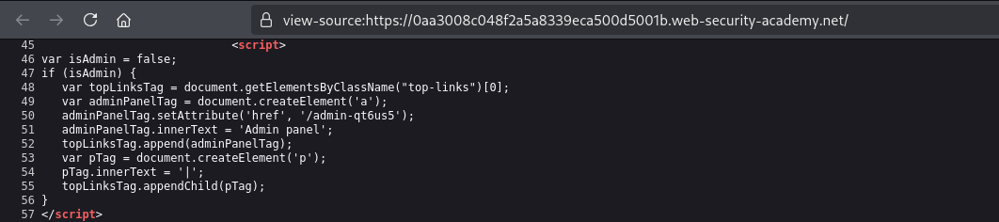
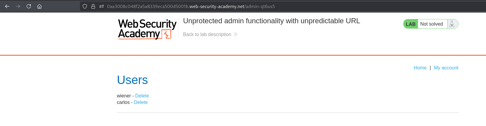
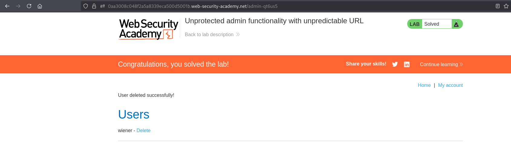

# Lab 02 - Unprotected Admin Functionality with Unpredictable URL

## Lab Information

* **Category:** Broken Access Control
* **Difficulty:** Apprentice
* **Vulnerability:** Unprotected Admin Functionality with Unpredictable URL

---

## Objective

Gain unauthorized access to the administrator panel and delete the user **Carlos**.

---

## Tools Used

* Web Browser

---

## Methodology

Before attempting to solve the lab, I followed my standard web application assessment methodology:

1. Browse the application manually.
2. Understand the application's functionality and business logic.
3. Intercept traffic using Burp Suite.
4. Review the HTML source code.
5. Review HTTP requests and responses.
6. Inspect the Burp Suite Sitemap.
7. Check common discovery files.
8. If nothing is found, perform content discovery using FFUF.

---

## Reconnaissance

After exploring the application manually, I reviewed the application's HTML source code.

During the review, I identified a reference to an administrative endpoint.

---

## Discovery and Verification

### Step 1 – Discover the Administrator Endpoint

Inspect the application's HTML source code.

The HTML source code reveals the following administrative endpoint:

```text
/admin-qt6us5
```

**Screenshot 1:** Administrator endpoint disclosed in the HTML source code.



---

### Step 2 – Access the Administrator Panel

Navigate directly to:

```text
/admin-qt6us5
```

The administrator panel is accessible without authentication or authorization checks.

**Screenshot 2:** Successful access to the administrator panel.



---

### Step 3 – Perform an Administrative Action

Delete the user **Carlos** from the administrator panel.

**Screenshot 3:** Successful deletion of the user **Carlos**.



---

## Analysis

The administrator endpoint was disclosed within the application's HTML source code.

Since administrative functionality should require proper authorization, the next step was to verify whether access controls were enforced before attempting any privileged action.

The application failed to perform server-side authorization checks, allowing unrestricted access to administrative functionality.

---

## Exploitation

After navigating to the administrator endpoint, the administrator panel was accessible without any authentication or authorization checks.

The exposed administrative functionality allowed the deletion of the user **Carlos**, successfully completing the lab.

---

## Root Cause

The application relies on using an unpredictable administrator endpoint instead of enforcing proper server-side authorization checks.

Any user who discovers the endpoint can directly access privileged functionality.

---

## Impact

Successful exploitation could allow an attacker to:

* Gain unauthorized access to administrative functionality.
* Perform unauthorized administrative actions.
* Modify application data.
* Delete user accounts.

---

## Mitigation

To prevent this issue:

* Enforce server-side authorization checks on every administrative endpoint.
* Never rely on hidden, undisclosed, or unpredictable URLs as a security mechanism.
* Apply the Principle of Least Privilege (PoLP).
* Regularly test access control mechanisms during security assessments.

---

## Key Takeaways

* Hidden or unpredictable endpoints are not secure endpoints.
* Always inspect the HTML source code during reconnaissance.
* Sensitive functionality must always be protected by server-side authorization checks.
