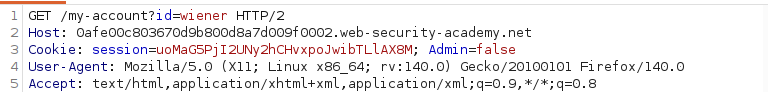
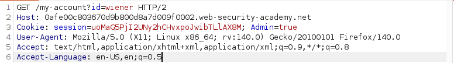
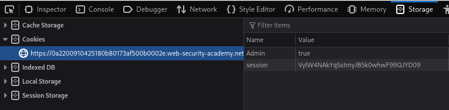
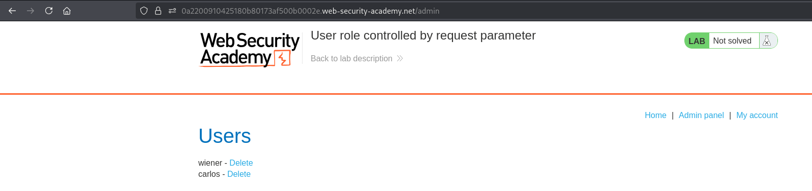
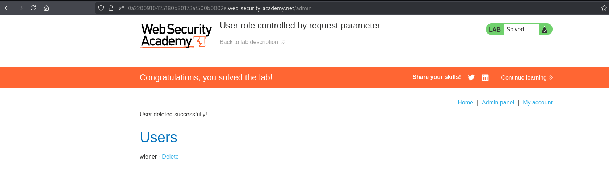

# Lab 03 - User role controlled by request parameter

## Lab Information

- **Category:** Broken Access Control
- **Difficulty:** Apprentice
- **Vulnerability:** User role controlled by request parameter

---

## Objective

Gain unauthorized access to the administrator panel and delete the user **Carlos**.

---

## Tools Used

- Web Browser
- Burp Suite

---

## Methodology

Before attempting to solve the lab, I followed my standard web application assessment methodology:

1. Browse the application manually.
2. Understand the application's functionality and business logic.
3. Intercept traffic using Burp Suite.
4. Review the HTML source code and JavaScript files.
5. Check common discovery files.
6. Inspect the Burp Suite Sitemap.
7. Review HTTP requests and their corresponding responses.
8. Analyze cookies, headers, and request parameters.
9. If nothing is found, perform content discovery using FFUF.

---

## Reconnaissance

After exploring the application manually, I reviewed the application's HTML source code, JavaScript files, and HTTP traffic.

During the analysis of the intercepted requests, I identified an `Admin` cookie with the following value:

```text
Admin=false
```

This indicated that the application might be relying on a client-controlled parameter to determine user privileges.

---

## Discovery and Verification

### Step 1 – Identify the Administrator Cookie

Review the intercepted HTTP requests.

The application includes the following cookie:

```text
Admin=false
```

**Screenshot 1:** Administrator cookie identified in the HTTP request.



---

### Step 2 – Modify the Cookie Value

Change the cookie value to:

```text
Admin=true
```

Resend the request using Burp Repeater.

The application grants access to administrator functionality.

**Screenshot 2:** Modified administrator cookie.



---

### Step 3 – Persist the Cookie in the Browser

Modify the cookie value inside the browser's Storage section:

```text
Admin=true
```

Refresh the page.

The administrator functionality becomes available within the application.

**Screenshot 3:** Modified administrator cookie in the browser.



---

### Step 4 – Access the Administrator Panel

Navigate to:

```text
/admin
```

The administrator panel is now accessible.

**Screenshot 4:** Successful access to the administrator panel.



---

### Step 5 – Perform an Administrative Action

Delete the user **Carlos**.

**Screenshot 5:** Successful deletion of the user **Carlos**.



---

## Analysis

The application stores the user's administrative role inside a client-controlled cookie.

Instead of validating user privileges on the server, it trusts the value supplied by the client. By modifying the cookie, an attacker can elevate their privileges and gain unauthorized administrative access.

---

## Exploitation

After changing the value of the `Admin` cookie to `true`, the application treated the user as an administrator without performing any server-side authorization checks.

This allowed access to the administrator panel and the successful deletion of the user **Carlos**.

---

## Root Cause

The application relies on a client-controlled cookie to determine user privileges.

Authorization decisions should never be based on data that can be modified by the client.

---

## Impact

Successful exploitation could allow an attacker to:

- Escalate privileges to administrator.
- Access privileged functionality.
- Perform unauthorized administrative actions.
- Modify or delete application data.
- Fully compromise the application's authorization model.

---

## Mitigation

To prevent this issue:

- Perform authorization checks on the server for every privileged request.
- Never trust client-controlled data such as cookies, headers, hidden fields, or request parameters for authorization decisions.
- Store user roles securely on the server.
- Apply the Principle of Least Privilege (PoLP).
- Regularly test access control mechanisms during security assessments.

---

## Key Takeaways

- Never trust client-controlled data for authorization decisions.
- Cookies, headers, hidden fields, and request parameters can all be manipulated by attackers.
- User roles should always be validated on the server.
- User roles should never be stored in client-controlled data.
- Sensitive functionality must always be protected by server-side authorization checks.