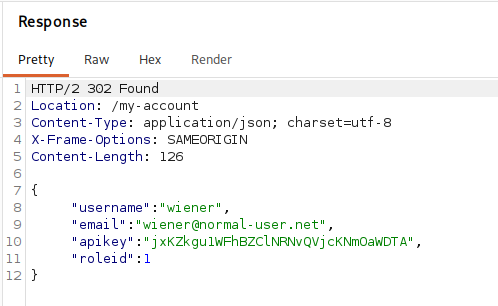
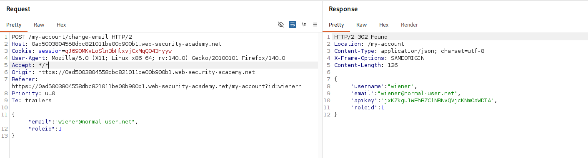
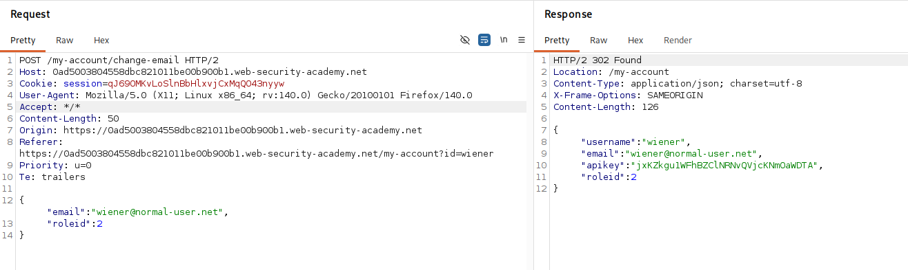
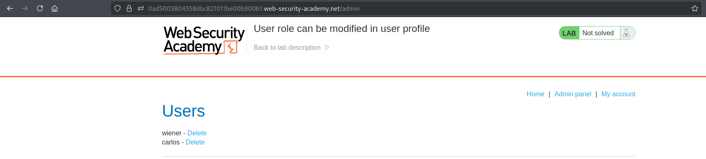
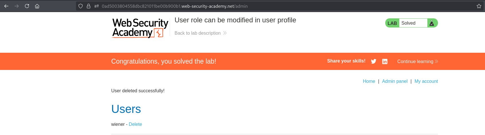

# Lab 04 - User role can be modified in user profile

## Lab Information

- **Category:** Broken Access Control
- **Difficulty:** Apprentice
- **Vulnerability:** User role can be modified in user profile

---

## Objective

Gain unauthorized access to the administrator panel and delete the user **Carlos**.

---

## Tools Used

- Web Browser
- Burp Suite

---

## Methodology

Before attempting to solve the lab, I followed my standard web application assessment methodology:

1. Browse the application manually.
2. Understand the application's functionality and business logic.
3. Intercept traffic using Burp Suite.
4. Review the HTML source code and JavaScript files.
5. Check common discovery files.
6. Inspect the Burp Suite Sitemap.
7. Compare HTTP requests with their corresponding responses.
8. Analyze cookies, headers, and request parameters.
9. If nothing is found, perform content discovery using FFUF.

---

## Reconnaissance

After exploring the application manually, I reviewed the application's HTML source code, JavaScript files, and intercepted HTTP traffic.

During the analysis of the intercepted requests and their corresponding responses, I noticed that the response to the email update request contains a `roleId` parameter with the following value:

```text
"roleId":1
```

This indicated that the application might be relying on a client-controlled parameter to determine user privileges.

---

## Discovery and Verification

### Step 1 – Identify the RoleId Parameter

Review the intercepted HTTP requests and their corresponding responses.

The application includes the following parameter:

```text
"roleId":1
```

**Screenshot 1:** RoleId parameter identified in the HTTP response.



---

### Step 2 – Add the Parameter to the Request

Add the following parameter to the request:

```text
"roleId":1
```

Resend the request using Burp Repeater.

The server accepts the unexpected parameter without returning an error.

**Screenshot 2:** Parameter added to the request.



---

### Step 3 – Modify the Parameter Value

Change the parameter value to:

```text
"roleId":2
```

Resend the request using Burp Repeater.

The server successfully updates the user's role.

**Screenshot 3:** Modified parameter value.



---

### Step 4 – Access the Administrator Panel

Navigate to:

```text
/admin
```

The administrator panel is now accessible.

**Screenshot 4:** Successful access to the administrator panel.



---

### Step 5 – Perform an Administrative Action

Delete the user **Carlos**.

**Screenshot 5:** Successful deletion of the user **Carlos**.



---

## Analysis

The application exposes the user's role in the server response and accepts the same parameter from the client during profile updates.

By trusting the client-supplied value, the application allows an attacker to modify their own privileges and gain unauthorized administrative access.

---

## Exploitation

After adding the `roleId` parameter to the request and changing its value to `2`, the application treated the user as an administrator without performing any server-side authorization checks.

This allowed access to the administrator panel and the successful deletion of the user **Carlos**.

---

## Root Cause

The application accepts a client-supplied `roleId` parameter and uses it to update user privileges without validating whether the current user is authorized to modify this attribute.

---

## Impact

Successful exploitation could allow an attacker to:

- Escalate privileges to administrator.
- Access privileged functionality.
- Perform unauthorized administrative actions.
- Modify or delete application data.
- Fully compromise the application's authorization model.

---

## Mitigation

To prevent this issue:

- Do not allow clients to modify security-sensitive attributes such as user roles.
- Perform server-side authorization checks before processing any privileged operation.
- Never trust client-controlled data such as cookies, headers, hidden fields, or request parameters for authorization decisions.
- Store user roles securely on the server.
- Apply the Principle of Least Privilege (PoLP).
- Regularly test access control mechanisms during security assessments.

---

## Key Takeaways

- Never trust client-controlled data for authorization decisions.
- Security-sensitive attributes should never be modifiable by users.
- Cookies, headers, hidden fields, and request parameters can all be manipulated by attackers.
- User roles should always be validated on the server.
- Sensitive functionality must always be protected by server-side authorization checks.