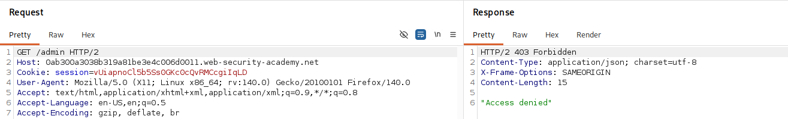
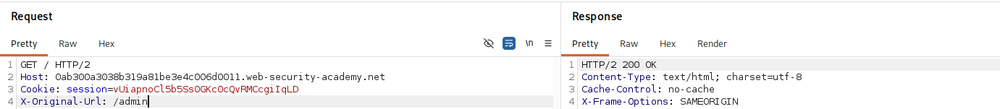
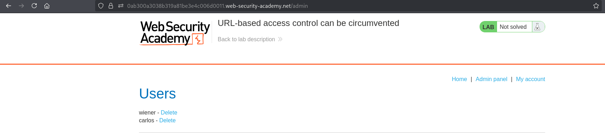
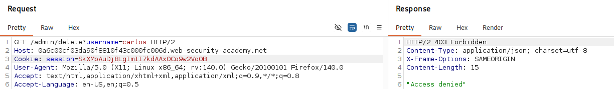
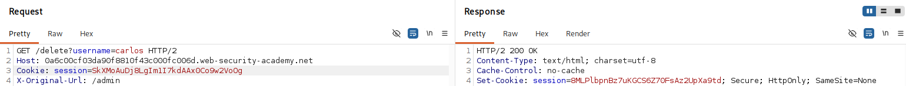
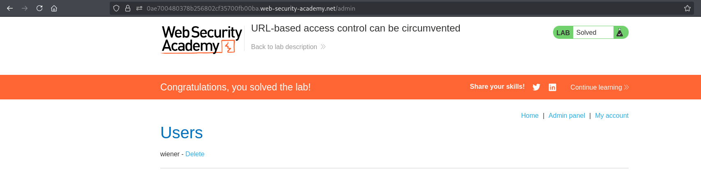

# Lab 05 - URL-based access control can be circumvented

## Lab Information

- **Category:** Broken Access Control
- **Difficulty:** Practitioner
- **Vulnerability:** URL-based access control can be circumvented

---

## Objective

Gain unauthorized access to the administrator panel and delete the user **Carlos**.

---

## Tools Used

- Web Browser
- Burp Suite

---

## Methodology

Before attempting to solve the lab, I followed my standard web application assessment methodology:

1. Browse the application manually.
2. Understand the application's functionality and business logic.
3. Identify user roles and available functionality.
4. Intercept traffic using Burp Suite.
5. Review HTTP requests and their corresponding responses.
6. Analyze cookies, headers, parameters, and authentication mechanisms.
7. Review the HTML source code and JavaScript files.
8. Check common discovery files.
9. Inspect the Burp Suite Sitemap.
10. Look for sensitive information disclosed in server responses.
11. Test whether client-controlled data influences server-side authorization decisions.
12. Compare how the application behaves before and after authentication (when applicable).
13. If no attack surface is identified, perform content discovery using FFUF.
14. Verify the finding and assess its impact.

---

## Reconnaissance

After exploring the application manually, I reviewed the JavaScript files and analyzed the intercepted HTTP traffic.

During the exploration, I identified an existing `/admin` endpoint that returned a `403 Forbidden` response, indicating that administrative functionality exists but is protected.

---

## Discovery and Verification

### Step 1 – Attempt to Access the Administrator Panel

Navigate to:

```text
/admin
```

The server responds with `403 Forbidden`, indicating that access to the endpoint is restricted.

**Screenshot 1:** Access denied when requesting the administrator endpoint.



---

### Step 2 – Bypass the URL-Based Access Control

Intercept the request and add the following HTTP header:

```text
X-Original-URL: /admin
```

Resend the request using Burp Repeater.

The server accepts and processes the client-supplied header without validation.

**Screenshot 2:** Adding the `X-Original-URL` header.



---

### Step 3 – Access the Administrator Panel

Navigate to:

```text
/admin
```

The administrator panel is now accessible.

**Screenshot 3:** Successful access to the administrator panel.



---

### Step 4 – Attempt to Delete Carlos

Navigate to:

```text
/admin/delete?username=carlos
```

The server again responds with `403 Forbidden`.

**Screenshot 4:** Access denied when attempting to delete the user.



---

### Step 5 – Bypass the Access Control

Intercept the request and add the following HTTP header:

```text
X-Original-URL: /admin/delete
```

Resend the request using Burp Repeater.

The server processes the request as an administrative action and deletes the user.

**Screenshot 5:** Bypassing access control using the `X-Original-URL` header.



---

### Step 6 – Verify the Result

The user **Carlos** has been successfully deleted, confirming that the access control has been bypassed.

**Screenshot 6:** Successful deletion of the user **Carlos**.



---

## Analysis

The application relies on the `X-Original-URL` header when determining the requested resource.

Because this header is accepted directly from the client without validation, an attacker can manipulate it to bypass the URL-based access control mechanism and gain unauthorized access to protected functionality.

---

## Exploitation

By adding the `X-Original-URL` header with the value `/admin`, the application processes the request as if it were targeting the protected administrative endpoint.

The same technique can be applied to privileged administrative actions such as deleting users by supplying:

```text
X-Original-URL: /admin/delete
```

As a result, the application bypasses the URL-based authorization mechanism and allows unauthorized administrative actions.

---

## Root Cause

The application trusts the client-supplied `X-Original-URL` header when determining the effective request path.

Instead of performing authorization checks against the original client request, the application processes the rewritten URL without verifying whether the client is authorized to access the requested resource.

As a result, authorization decisions are made based on a user-controlled value.

---

## Impact

Successful exploitation could allow an attacker to:

- Gain unauthorized access to administrative functionality.
- Bypass URL-based access control restrictions.
- Perform unauthorized administrative actions.
- Modify or delete application data.
- Fully compromise the application's authorization model.

---

## Mitigation

To prevent this issue:

- Do not trust client-supplied rewrite headers such as `X-Original-URL` when making authorization decisions.
- Remove or ignore rewrite headers received directly from untrusted clients.
- Perform authorization checks after URL rewriting has been completed.
- Ensure rewrite headers can only be added by trusted reverse proxies.
- Never trust client-controlled data such as cookies, headers, hidden fields, or request parameters for authorization decisions.
- Apply the Principle of Least Privilege (PoLP).
- Regularly test access control mechanisms during security assessments.

---

## Key Takeaways

- Never trust client-controlled data for authorization decisions.
- URL rewrite headers should never be trusted when enforcing access control.
- Authorization checks must be applied to the final rewritten request path, not only the original request.
- Authorization decisions must always be enforced on the server.
- Sensitive functionality must always be protected by server-side authorization checks.
- Reverse proxy headers should only be accepted from trusted infrastructure.