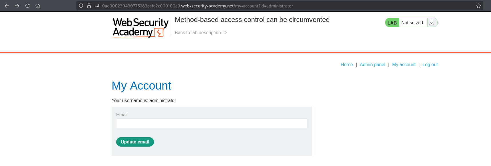
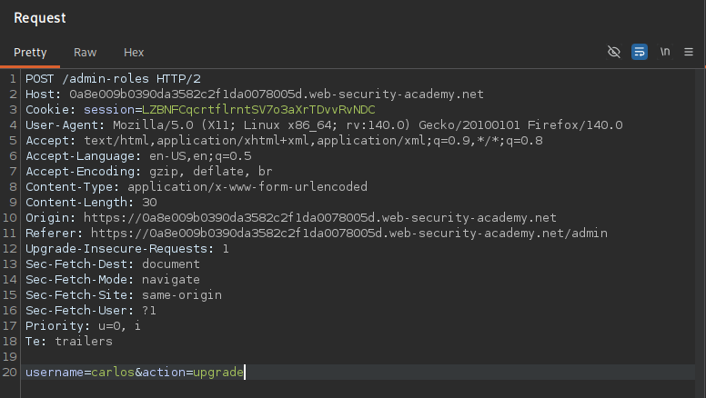
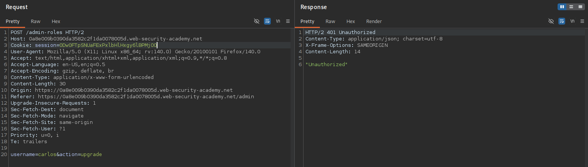
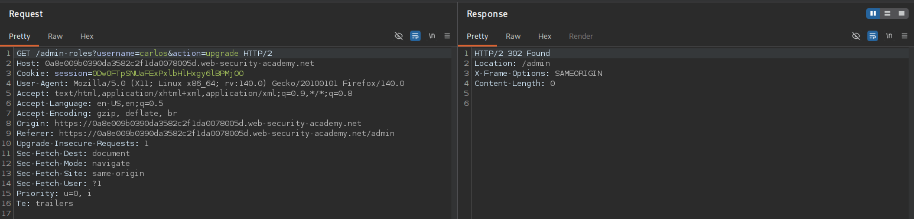
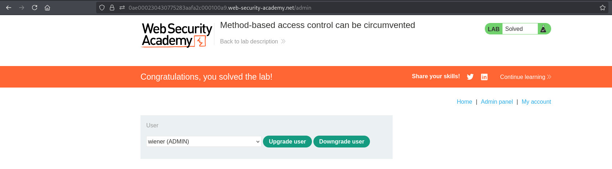

# Lab 06 - Method-based access control can be circumvented

## Lab Information

- **Category:** Broken Access Control
- **Difficulty:** Practitioner
- **Vulnerability:** Method-based access control can be circumvented

---

## Objective

Gain unauthorized access to the administrator functionality and upgrade the user **wiener** to an administrator.

---

## Tools Used

- Web Browser
- Burp Suite

---

## Methodology

Before attempting to solve the lab, I followed my standard web application assessment methodology:

1. Browse the application manually.
2. Understand the application's functionality and business logic.
3. Identify user roles and available functionality.
4. Intercept traffic using Burp Suite.
5. Review HTTP requests and their corresponding responses.
6. Analyze cookies, headers, parameters, and authentication mechanisms.
7. Review the HTML source code and JavaScript files.
8. Check common discovery files.
9. Inspect the Burp Suite Sitemap.
10. Look for sensitive information disclosed in server responses.
11. Test whether client-controlled data influences server-side authorization decisions.
12. Compare how the application behaves before and after authentication (when applicable).
13. If no attack surface is identified, perform content discovery using FFUF.
14. Verify the finding and assess its impact.

---

## Reconnaissance

After exploring the application manually, I identified the administrator functionality.

While interacting with it, I intercepted the request responsible for upgrading a user to an administrator.

---

## Discovery and Verification

### Step 1 – Access the Administrator Panel

Sign in as the administrator and navigate to the administrator panel.

**Screenshot 1:** Administrator panel.



---

### Step 2 – Capture the Upgrade Request

Upgrade the user **wiener** while Burp Suite intercepts the request.

**Screenshot 2:** Upgrade request.



---

### Step 3 – Replay the Request as a Regular User

Replace the administrator session with the regular user's session and resend the request.

The server responds with:

```text
401 Unauthorized
```

**Screenshot 3:** Regular user receives `401 Unauthorized`.



---

### Step 4 – Change the HTTP Method

Instead of modifying the endpoint, cookies, headers, or request parameters, change only the HTTP method from:

```text
POST
```

to:

```text
GET
```

Resend the request.

The server now responds with:

```text
302 Found
```

**Screenshot 4:** Changing the HTTP method.



---

### Step 5 – Verify the Result

Return to the administrator panel and verify that the user **wiener** has been upgraded successfully.

**Screenshot 5:** User successfully upgraded.



---

## Analysis

The application applies its authorization checks only when the request uses the `POST` method.

Changing the request to `GET` bypasses those checks, allowing a regular user to perform an administrative action.

This indicates that authorization is enforced on a specific HTTP method rather than on the protected functionality itself.

---

## Exploitation

By changing only the HTTP method from `POST` to `GET`, the application accepts the request and upgrades the regular user to an administrator.

This demonstrates that the access control mechanism depends on the request method instead of protecting the administrative functionality itself.

---

## Root Cause

The application performs authorization checks only for requests using the `POST` method.

Instead of enforcing access control regardless of the HTTP method, the application allows the same administrative functionality to be accessed using a different method.

---

## Impact

Successful exploitation could allow an attacker to:

- Gain unauthorized access to administrative functionality.
- Bypass method-based access control restrictions.
- Perform unauthorized administrative actions.
- Escalate privileges.
- Fully compromise the application's authorization model.

---

## Mitigation

To prevent this issue:

- Apply authorization checks consistently across all supported HTTP methods.
- Protect administrative functionality rather than individual request methods.
- Deny unexpected HTTP methods when they are not required.
- Apply the Principle of Least Privilege (PoLP).
- Regularly test access control mechanisms during security assessments.

---

## Key Takeaways

- Access control should protect the functionality, not a specific HTTP method.
- Always test whether an endpoint behaves differently when using other HTTP methods.
- Authorization checks should be consistent regardless of the HTTP method used.
- Changing only one part of a request at a time helps identify the exact cause of a vulnerability.