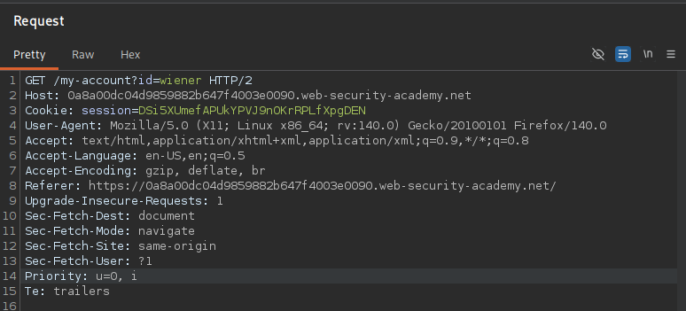
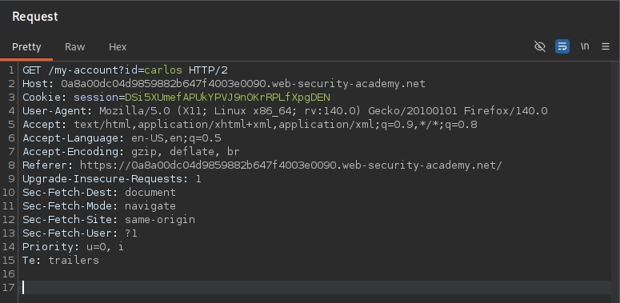
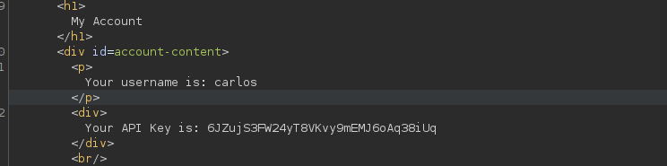
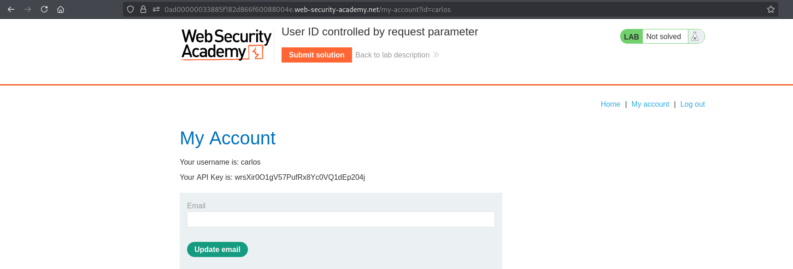
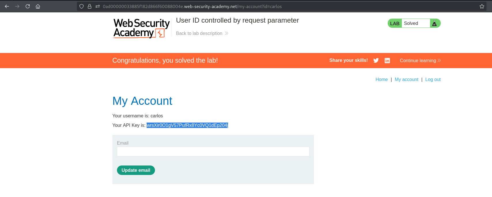

# Lab 07 - User ID controlled by request parameter

## Lab Information

- **Category:** Broken Access Control
- **Difficulty:** APPRENTICE
- **Vulnerability:** User ID controlled by request parameter

---

## Objective

Obtain the API key for the user **Carlos** by exploiting a broken access control vulnerability.

---

## Tools Used

- Web Browser
- Burp Suite

---

## Methodology

Before attempting to solve the lab, I followed my standard web application assessment methodology:

1. Browse the application manually.
2. Understand the application's functionality and business logic.
3. Identify user roles and available functionality.
4. Intercept traffic using Burp Suite.
5. Review HTTP requests and their corresponding responses.
6. Analyze cookies, headers, parameters, and authentication mechanisms.
7. Review the HTML source code and JavaScript files.
8. Check common discovery files.
9. Inspect the Burp Suite Sitemap.
10. Look for sensitive information disclosed in server responses.
11. Test whether client-controlled data influences server-side authorization decisions.
12. Compare how the application behaves before and after authentication (when applicable).
13. If no attack surface is identified, perform content discovery using FFUF.
14. Verify the finding and assess its impact.

---

## Reconnaissance

After exploring the application manually and authenticating as **wiener**, I observed that the **My Account** page was requested using a client-controlled query parameter.

```http
GET /my-account?id=wiener
```

During traffic analysis, I noticed that the application identifies the requested account using the `id` parameter supplied by the client.

Based on this observation, I hypothesized that modifying the value of the `id` parameter might allow access to another user's account if authorization was not properly enforced.

---

## Discovery and Verification

### Step 1 – Open My Account

Log in as **wiener** and navigate to the **My Account** page.

**Screenshot 1:** Open My Account.



---

### Step 2 – Modify the User ID Parameter

Intercept the request and replace:

```text
id=wiener
```

with:

```text
id=carlos
```

Forward the modified request.

**Screenshot 2:** Modify the User ID Parameter.



---

### Step 3 – Access Carlos's Account

The modified request is processed successfully, allowing access to Carlos's account.

**Screenshot 3:** Access Carlos's Account.



---

### Step 4 – Retrieve Carlos's API Key

Locate and copy Carlos's API key from the account page.

**Screenshot 4:** Retrieve Carlos's API Key.



---

### Step 5 – Submit Carlos's API Key

Submit Carlos's API key to complete the lab.

**Screenshot 5:** Submit Carlos's API Key.



---

## Analysis

The application determines which account to display using a client-controlled query parameter but fails to verify whether the requested resource belongs to the authenticated user.

By modifying only the value of the `id` parameter, an authenticated user can access another user's account without authorization.

This is a classic example of **Insecure Direct Object Reference (IDOR)** resulting in **Horizontal Privilege Escalation**.

---

## Exploitation

An authenticated attacker intercepts the request to their own account and modifies the value of the `id` parameter to reference another user.

Because the server does not validate resource ownership against the authenticated session, it returns the target user's account information, including sensitive data such as the API key.

---

## Root Cause

The application relies on a client-controlled parameter to identify the requested resource.

Instead of validating that the requested account belongs to the authenticated user, the server directly trusts the value supplied by the client.

---

## Impact

Successful exploitation could allow an attacker to:

- Access other users' accounts.
- View sensitive user information.
- Retrieve confidential API keys.
- Compromise the confidentiality of user data.
- Perform horizontal privilege escalation.

---

## Mitigation

To prevent this issue:

- Never trust client-controlled identifiers for authorization decisions.
- Identify the current user using the authenticated session instead of request parameters whenever possible.
- Validate ownership of every requested resource on the server side.
- Implement object-level authorization checks for every request.
- Regularly test applications for IDOR vulnerabilities during security assessments.

---

## Key Takeaways

- Authentication does not guarantee authorization.
- Never trust client-controlled identifiers to enforce access control.
- Always validate that the authenticated user owns the requested resource.
- Test every parameter that references users or application resources.
- Modifying a single parameter can reveal critical authorization vulnerabilities.