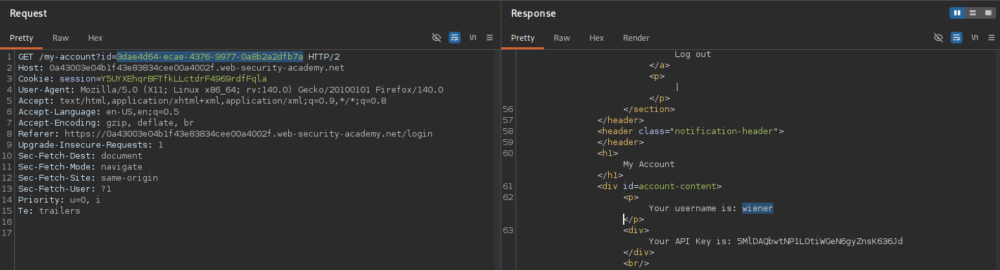
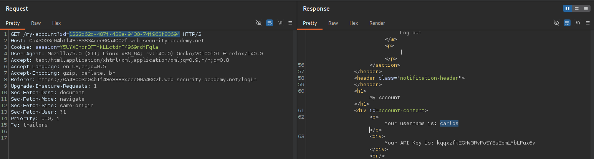
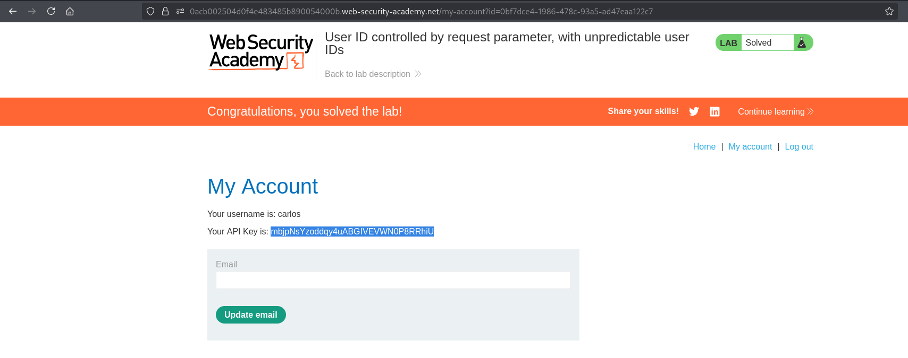

# BAC-008 - User ID controlled by request parameter, with unpredictable user IDs

## Report Information

- **Category:** Broken Access Control
- **Subcategory:** Horizontal Privilege Escalation (IDOR)
- **Severity:** High

---

## Executive Summary

The application identifies user accounts using a client-controlled `userId` query parameter without verifying whether the requested account belongs to the authenticated user.

Although the application uses unpredictable UUIDs instead of sequential identifiers, these UUIDs are exposed through publicly accessible user profile pages.

By obtaining another user's UUID and supplying it in the `userId` parameter, an attacker can access another user's account and retrieve sensitive information, resulting in an **Insecure Direct Object Reference (IDOR)** vulnerability.

---

## Affected Components

- User account functionality (`/my-account`)
- User profile functionality
- Object-level authorization mechanism
- User account information

---

## Vulnerability Description

The application determines which account to display based on the value of the client-controlled `userId` query parameter.

Although unpredictable UUIDs are used to identify users, these identifiers are publicly disclosed through blog author profiles.

Because the server does not validate that the requested account belongs to the authenticated user, an attacker can reuse another user's UUID to access their account.

As a result, the application exposes sensitive information, including the target user's API key.

This issue results in a **Horizontal Privilege Escalation (IDOR)** vulnerability.

---

## Proof of Concept (PoC)

### Step 1 – Open My Account

Log in as **wiener** and navigate to the **My Account** page.

**Screenshot 1:** Open My Account.

---

### Step 2 – Modify the User ID Parameter

Intercept the request and replace your UUID with Carlos's UUID obtained from the blog author profile.

Forward the modified request.

The server returns Carlos's account information, including his API key.

**Screenshot 2:** Modify the User ID Parameter.

---

### Step 3 – Retrieve and Submit Carlos's API Key

Copy Carlos's API key from the account page and submit it to solve the lab.

**Screenshot 3:** Retrieve and Submit Carlos's API Key.

---

## Impact

Successful exploitation could allow an attacker to:

- Access other users' accounts.
- Retrieve sensitive information belonging to other users.
- Obtain confidential API keys.
- Compromise the confidentiality of user data.
- Perform horizontal privilege escalation.

---

## Root Cause

The application relies on a client-controlled `userId` parameter to determine which account should be returned.

Although UUIDs make identifiers difficult to guess, the application exposes them through publicly accessible functionality and trusts the supplied value without validating ownership.

As a result, modifying the `userId` parameter allows unauthorized access to another user's account.

---

## Remediation

To prevent this issue:

- Never trust client-controlled identifiers for authorization decisions.
- Validate ownership of every requested resource on the server side.
- Identify users using the authenticated session whenever possible.
- Do not rely on unpredictable identifiers as an authorization mechanism.
- Implement object-level authorization checks for every request.
- Follow the Principle of Least Privilege (PoLP).
- Regularly test applications for IDOR vulnerabilities during security assessments.