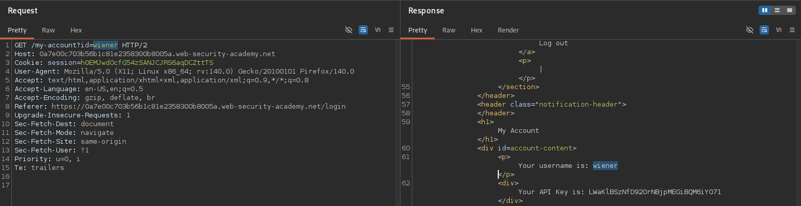
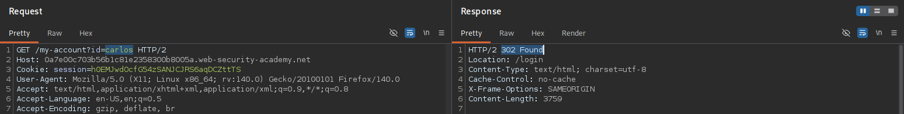
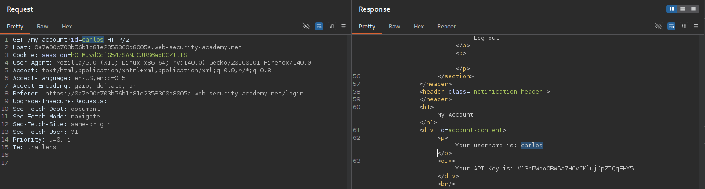
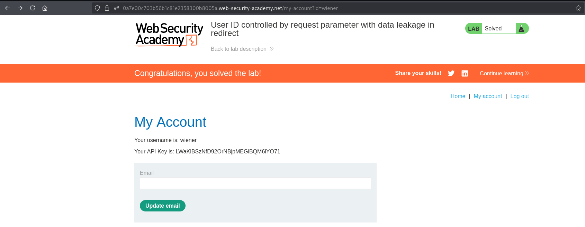

# BAC-009 - User ID controlled by request parameter with data leakage in redirect

## Report Information

- **Category:** Broken Access Control
- **Subcategory:** Horizontal Privilege Escalation (IDOR)
- **Severity:** High

---

## Executive Summary

The application determines which account to return using a client-controlled `id` parameter.

Although unauthorized requests are redirected to the login page, the server includes the requested user's account information in the HTTP response body before issuing the redirect.

An attacker intercepting the response can recover sensitive information, including the user's API key, resulting in an **Insecure Direct Object Reference (IDOR)** vulnerability combined with sensitive data leakage.

---

## Affected Components

- User account functionality (`/my-account`)
- Object-level authorization mechanism
- Redirect handling mechanism
- User account information

---

## Vulnerability Description

The application identifies user accounts based on a client-controlled `id` parameter.

When an attacker requests another user's account, the application responds with `302 Found` and redirects the browser.

However, before the redirect occurs, the response body already contains the requested user's account information.

As a result, anyone intercepting the traffic can recover sensitive data despite the browser automatically navigating away from the page.

This issue results in a **Horizontal Privilege Escalation (IDOR)** vulnerability with sensitive data disclosure.

---

## Proof of Concept (PoC)

### Step 1 – Open My Account

Log in as **wiener** and open the **My Account** page.

**Screenshot 1:** Open My Account.



---

### Step 2 – Modify the User ID Parameter

Replace:

```text
id=wiener
```

with:

```text
id=carlos
```

The server responds with:

```text
302 Found
```

**Screenshot 2:** Modify the User ID Parameter.



---

### Step 3 – Inspect the Redirect Response

Review the raw HTTP response and observe that Carlos's account information, including the API key, is disclosed before the redirect.

**Screenshot 3:** Data Leakage in Redirect Response.



---

### Step 4 – Verify the Result

Submit Carlos's API key to solve the lab.

**Screenshot 4:** Lab Solved.



---

## Impact

Successful exploitation could allow an attacker to:

- Access sensitive information belonging to other users.
- Retrieve confidential API keys.
- Exploit information disclosure despite server redirects.
- Compromise the confidentiality of user accounts.
- Perform horizontal privilege escalation.

---

## Root Cause

The application generates and includes protected account information in the HTTP response before enforcing authorization through a redirect.

Authorization should be evaluated before generating or returning any sensitive content.

---

## Remediation

To prevent this issue:

- Perform authorization checks before generating protected resources.
- Never include sensitive data in redirect responses.
- Validate ownership of every requested resource on the server side.
- Return only the required redirect response without exposing protected content.
- Regularly test applications for IDOR and information disclosure vulnerabilities.