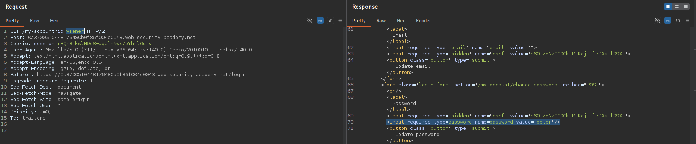
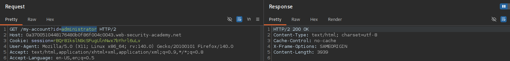
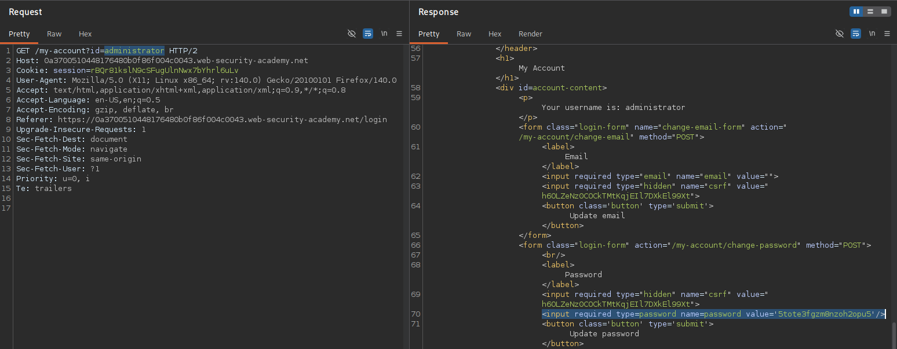
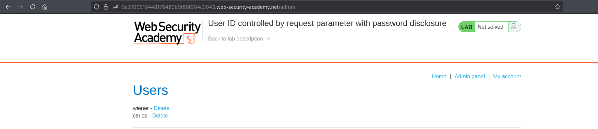
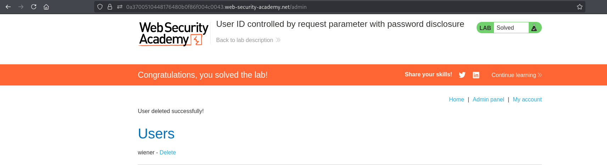

# BAC-010 - User ID controlled by request parameter with password disclosure

## Report Information

- **Category:** Broken Access Control
- **Subcategory:** Horizontal Privilege Escalation leading to Vertical Privilege Escalation
- **Severity:** High

---

## Executive Summary

The application identifies user accounts using a client-controlled `id` parameter without validating resource ownership.

By modifying the identifier to reference another account, an attacker can retrieve sensitive account information, including passwords exposed in the HTML response.

If a privileged account, such as the administrator, is targeted, the disclosed credentials can be used to gain administrative access and fully compromise the application's access control model.

---

## Affected Components

- User account functionality (`/my-account`)
- Object-level authorization mechanism
- Password management
- Administrative functionality

---

## Vulnerability Description

The application determines which account to display using a client-controlled `id` parameter.

Instead of validating that the requested account belongs to the authenticated user, the server directly trusts the supplied identifier.

Additionally, the application exposes user passwords within the HTML response by embedding them in the value of a password input field.

By requesting another user's account, an attacker can recover that user's password. If the targeted account has administrative privileges, the attacker can authenticate as the administrator and gain full access to privileged functionality.

This vulnerability combines **Insecure Direct Object Reference (IDOR)** with **Sensitive Data Exposure**, enabling both **Horizontal** and **Vertical Privilege Escalation**.

---

## Proof of Concept (PoC)

### Step 1 – Open My Account

Log in as **wiener** and navigate to the **My Account** page.

**Screenshot 1:** Open My Account.



---

### Step 2 – Modify the User ID Parameter

Replace:

```text
id=wiener
```

with:

```text
id=administrator
```

Forward the modified request.

**Screenshot 2:** Modify User ID to Administrator.



---

### Step 3 – Retrieve the Administrator Password

Inspect the response and recover the administrator's password from the password input field.

**Screenshot 3:** Retrieve Administrator Password.



---

### Step 4 – Access the Administrator Panel

Authenticate using the recovered credentials and access the administrator panel.

**Screenshot 4:** Access Administrator Panel.



---

### Step 5 – Verify the Result

Delete the user **Carlos** to confirm successful administrative access.

**Screenshot 5:** Delete Carlos and Solve the Lab.



---

## Impact

Successful exploitation could allow an attacker to:

- Access other users' accounts.
- Retrieve passwords belonging to arbitrary users.
- Compromise privileged accounts.
- Gain unauthorized administrative access.
- Perform both horizontal and vertical privilege escalation.
- Fully compromise the confidentiality and integrity of the application.

---

## Root Cause

The application relies on a client-controlled identifier to determine which account should be returned.

Instead of validating ownership of the requested resource, the server directly trusts the supplied identifier.

Furthermore, sensitive credentials are unnecessarily included in the server response, exposing information that should never be returned to the client.

---

## Remediation

To prevent this issue:

- Never expose passwords or other sensitive credentials in server responses.
- Store passwords securely using strong one-way hashing algorithms.
- Enforce object-level authorization checks on every request.
- Identify users using the authenticated session instead of client-controlled parameters.
- Apply the Principle of Least Privilege (PoLP).
- Regularly test applications for both IDOR and Sensitive Data Exposure vulnerabilities.