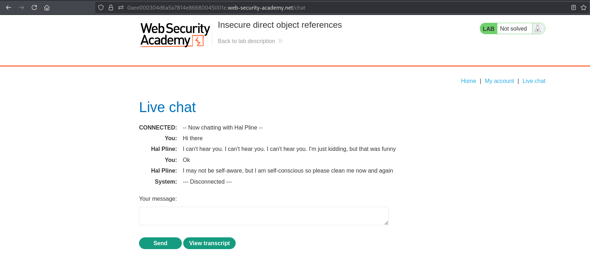
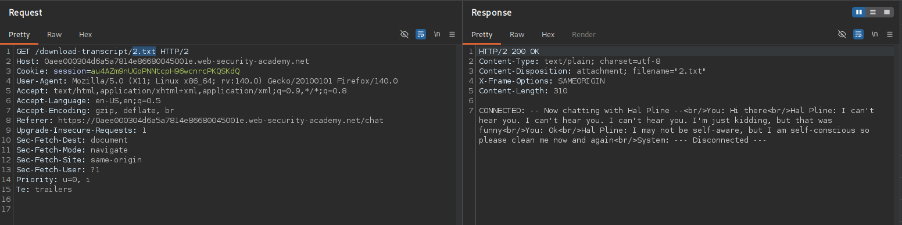
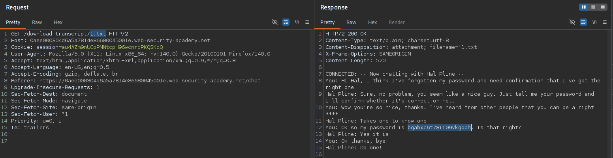
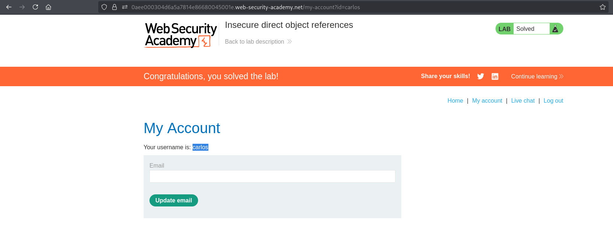

# BAC-011 - Insecure direct object references

## Report Information

- **Category:** Broken Access Control
- **Subcategory:** Insecure Direct Object Reference (IDOR)
- **Severity:** High

---

## Executive Summary

The application stores chat transcripts as static files and allows clients to retrieve them using predictable file names.

Because the server does not verify whether the requested transcript belongs to the authenticated user, an attacker can modify the requested file name to access another user's chat transcript.

In this lab, the disclosed transcript contains Carlos's login credentials, allowing unauthorized access to his account.

---

## Affected Components

- Live Chat transcript download functionality
- File access mechanism
- Object-level authorization

---

## Vulnerability Description

The application retrieves chat transcripts directly from the server's file system using predictable file names.

Instead of validating ownership of the requested transcript, the server returns any existing file referenced by the client.

By modifying the requested file name, an attacker can access transcripts belonging to other users and retrieve sensitive information contained within them.

This issue results in an **Insecure Direct Object Reference (IDOR)** vulnerability.

---

## Proof of Concept (PoC)

### Step 1 – Open the Live Chat

Send a message and download the generated transcript.

**Screenshot 1:** Open Live Chat.



---

### Step 2 – Download the Chat Transcript

Capture the transcript download request.

**Screenshot 2:** Download Chat Transcript.



---

### Step 3 – Modify the Transcript File Name

Replace:

```text
2.txt
```

with:

```text
1.txt
```

The server returns Carlos's chat transcript containing his credentials.

**Screenshot 3:** Modify Transcript File Name.



---

### Step 4 – Verify the Result

Authenticate using Carlos's credentials to successfully access his account.

**Screenshot 4:** Login as Carlos and Solve the Lab.



---

## Impact

Successful exploitation could allow an attacker to:

- Access other users' private chat transcripts.
- Retrieve sensitive credentials and confidential information.
- Compromise user accounts.
- Violate the confidentiality of user communications.

---

## Root Cause

The application directly exposes internal file references and fails to enforce object-level authorization when serving transcript files.

As a result, any client who can guess or enumerate valid file names can retrieve resources belonging to other users.

---

## Remediation

To prevent this issue:

- Enforce authorization checks before serving any file.
- Replace predictable file names with unpredictable identifiers.
- Ensure every requested resource belongs to the authenticated user.
- Avoid exposing internal storage structure to clients.
- Regularly assess file download functionality for IDOR vulnerabilities.