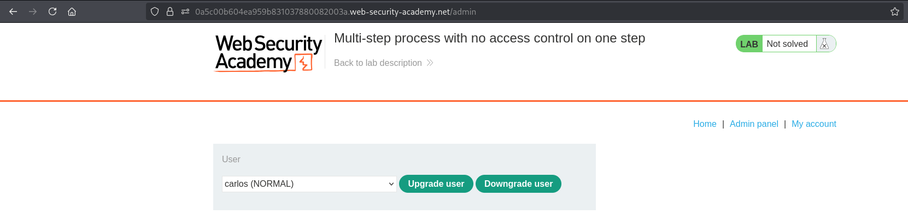
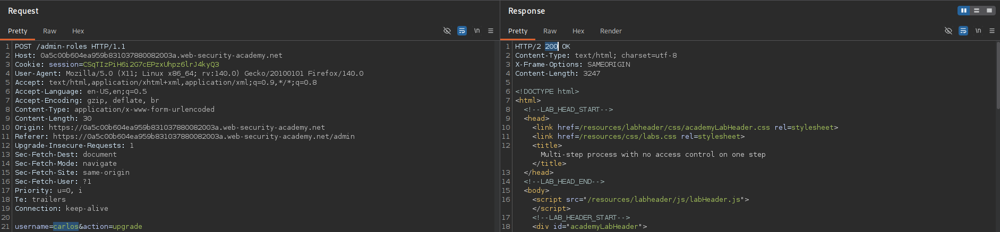
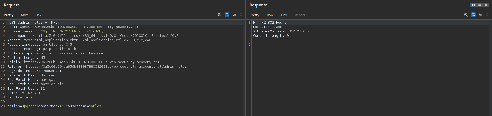
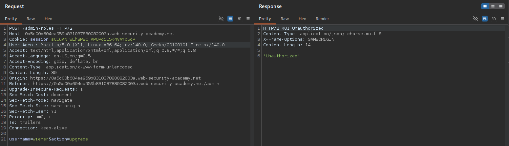
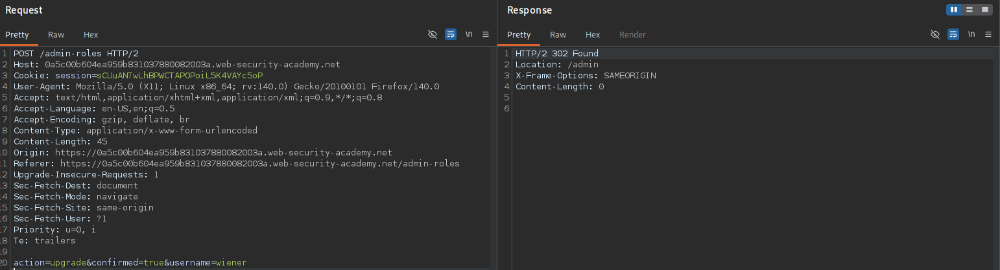
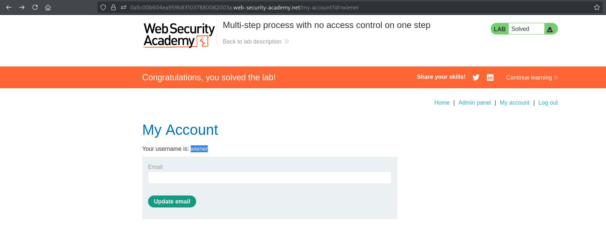

# Lab 12 - Multi-step process with no access control on one step

## Lab Information

- **Category:** Broken Access Control
- **Difficulty:** APPRENTICE
- **Vulnerability:** Multi-step process with no access control on one step

---

## Objective

Promote the user **wiener** to an administrator by exploiting an access control flaw in a multi-step workflow.

---

## Tools Used

- Web Browser
- Burp Suite

---

## Methodology

Before attempting to solve the lab, I followed my standard web application assessment methodology:

1. Browse the application manually.
2. Understand the application's functionality and business logic.
3. Identify user roles and available functionality.
4. Intercept traffic using Burp Suite.
5. Review HTTP requests and their corresponding responses.
6. Analyze cookies, headers, parameters, and authentication mechanisms.
7. Review the HTML source code and JavaScript files.
8. Check common discovery files.
9. Inspect the Burp Suite Sitemap.
10. Look for sensitive information disclosed in server responses.
11. Test whether client-controlled data influences server-side authorization decisions.
12. Compare how the application behaves before and after authentication (when applicable).
13. If no attack surface is identified, perform content discovery using FFUF.
14. Verify the finding and assess its impact.

---

## Reconnaissance

After logging in as the administrator, I discovered that user role management is performed through a multi-step workflow.

Promoting a user requires two separate HTTP requests:

1. Upgrade request.
2. Confirmation request.

Based on this observation, I tested whether both steps enforced authorization independently.

---

## Discovery and Verification

### Step 1 – Open the Administrator Panel

Log in as the administrator and open the **Admin Panel**.

**Screenshot 1:** Open Admin Panel.



---

### Step 2 – Capture the Multi-step Workflow

Promote **wiener** to Administrator while intercepting the requests.

The application performs the action using two separate requests:

- Upgrade Request
- Confirmation Request

**Screenshot 2:** Upgrade User Request.



**Screenshot 3:** Confirmation Request.



---

### Step 3 – Replay the Upgrade Request as Wiener

Log in as **wiener** and replay the **Upgrade Request**.

The server responds with:

```text
401 Unauthorized
```

**Screenshot 4:** Upgrade Request Unauthorized.



---

### Step 4 – Replay the Confirmation Request as Wiener

Replay only the **Confirmation Request** using **wiener's** session.

The server successfully processes the request.

**Screenshot 5:** Confirmation Request Success.



---

### Step 5 – Verify the Result

Return to the application and verify that **wiener** has been promoted to an administrator.

**Screenshot 6:** Wiener Becomes Administrator.



---

## Analysis

The application performs authorization checks on the initial upgrade request but fails to enforce the same authorization on the confirmation step.

Because the confirmation request can be executed independently, a regular user can bypass the protected step and directly invoke the unprotected confirmation request.

This results in a **Vertical Privilege Escalation** vulnerability.

---

## Exploitation

An attacker first identifies that the administrative workflow consists of multiple HTTP requests.

After testing each request individually, the attacker discovers that only the first request performs authorization checks.

By replaying the confirmation request directly, the attacker bypasses the protected step and successfully promotes their own account to an administrator.

---

## Root Cause

Authorization is enforced only on part of the multi-step workflow.

Instead of validating permissions on every security-sensitive request, the application assumes that the user has already been authorized during a previous step.

---

## Impact

Successful exploitation could allow an attacker to:

- Bypass access control during multi-step workflows.
- Escalate privileges.
- Perform unauthorized administrative actions.
- Fully compromise the application's authorization model.

---

## Mitigation

To prevent this issue:

- Apply authorization checks to every request within a multi-step workflow.
- Never assume previous requests have already been authorized.
- Validate user permissions independently for every security-sensitive action.
- Follow the Principle of Least Privilege (PoLP).
- Regularly assess multi-step workflows during security testing.

---

## Key Takeaways

- Every step of a multi-step workflow must enforce authorization independently.
- Never assume that a previous step guarantees authorization for subsequent requests.
- Replay each request individually when testing multi-step functionality.
- Missing authorization on a single step can compromise the entire workflow.