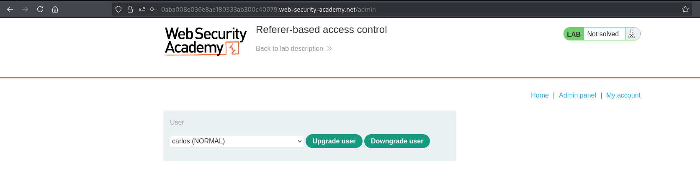
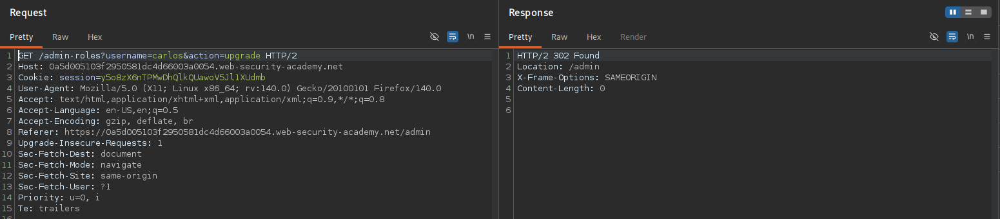
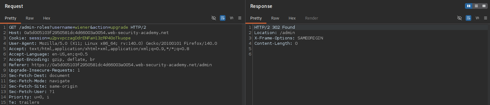
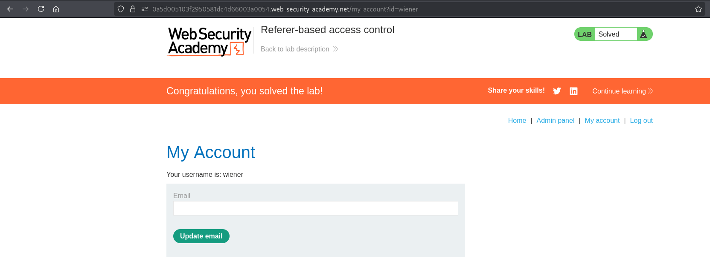

# Lab 13 - Referer-based access control

## Lab Information

- **Category:** Broken Access Control
- **Difficulty:** APPRENTICE
- **Vulnerability:** Referer-based access control

---

## Objective

Promote the user **wiener** to an administrator by exploiting an access control flaw that relies on the `Referer` header.

---

## Tools Used

- Web Browser
- Burp Suite

---

## Methodology

Before attempting to solve the lab, I followed my standard web application assessment methodology:

1. Browse the application manually.
2. Understand the application's functionality and business logic.
3. Identify user roles and available functionality.
4. Intercept traffic using Burp Suite.
5. Review HTTP requests and their corresponding responses.
6. Analyze cookies, headers, parameters, and authentication mechanisms.
7. Review the HTML source code and JavaScript files.
8. Check common discovery files.
9. Inspect the Burp Suite Sitemap.
10. Look for sensitive information disclosed in server responses.
11. Test whether client-controlled data influences server-side authorization decisions.
12. Compare how the application behaves before and after authentication (when applicable).
13. If no attack surface is identified, perform content discovery using FFUF.
14. Verify the finding and assess its impact.

---

## Reconnaissance

After logging in as the administrator, I discovered that user role management was performed through the **Admin Panel**.

While intercepting the role update request, I noticed that it contained a `Referer` header pointing to the administrative page.

Since the `Referer` header is completely controlled by the client, I tested whether the application relied on it as part of its authorization logic.

---

## Discovery and Verification

### Step 1 – Open the Administrator Panel

Log in as the administrator and navigate to the **Admin Panel**.

**Screenshot 1:** Open Admin Panel.



---

### Step 2 – Capture the Administrative Request

Promote **wiener** to Administrator while intercepting the request.

The captured request includes the `Referer` header.

**Screenshot 2:** Admin Upgrade Request.



---

### Step 3 – Replay the Request Using Wiener's Session

Log in as **wiener**, replace only the administrator's session cookie with **wiener's** session, and replay the captured request.

The original `Referer` header remains unchanged.

The server accepts the request and upgrades **wiener** to Administrator.

**Screenshot 3:** Upgrade Request as Wiener.



---

### Step 4 – Verify the Result

Return to the application and verify that **wiener** has been promoted successfully.

**Screenshot 4:** Wiener Becomes Administrator.



---

## Analysis

The application incorrectly relies on the client-supplied `Referer` header as part of its authorization logic.

During testing, a legitimate administrative request was replayed after replacing only the administrator's session cookie with a regular user's session. The original `Referer` header remained unchanged.

Despite the request being sent by a low-privileged user, the server accepted it and performed the administrative action.

This demonstrates that authorization is not based solely on the authenticated user's privileges, but is incorrectly influenced by a client-controlled HTTP header.

This results in a **Vertical Privilege Escalation** vulnerability.

---

## Exploitation

An attacker captures a legitimate administrative request containing the expected `Referer` header.

Instead of modifying the request, the attacker simply replaces the administrator's session cookie with their own authenticated session and replays the request.

Because the application relies on the client-supplied `Referer` header instead of properly validating the authenticated user's privileges, the server processes the request successfully and performs the privileged action.

---

## Root Cause

The application incorrectly trusts the client-controlled `Referer` header when making authorization decisions.

Instead of validating the authenticated user's privileges on the server side for every privileged request, the application partially relies on request metadata that can be captured and replayed by an attacker.

---

## Impact

Successful exploitation could allow an attacker to:

- Escalate privileges.
- Perform unauthorized administrative actions.
- Bypass authorization controls.
- Compromise the integrity of the application's authorization model.

---

## Mitigation

To prevent this issue:

- Never rely on the `Referer` header for authorization decisions.
- Perform authorization checks exclusively on the server side.
- Validate user privileges for every privileged request.
- Treat all client-supplied headers as untrusted input.
- Regularly test access control mechanisms during security assessments.

---

## Key Takeaways

- The `Referer` header is controlled by the client and should never be trusted.
- Authorization decisions must always be based on the authenticated user's privileges.
- Every privileged request must enforce server-side authorization checks.
- Client-controlled headers should never determine access rights.
```